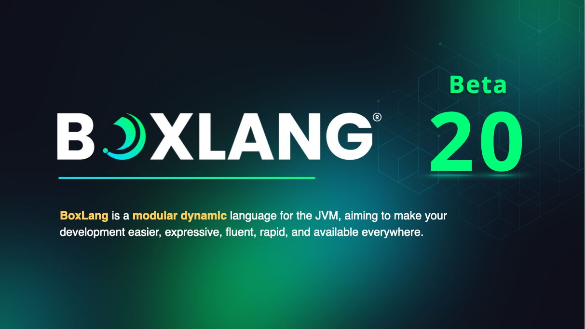

# 1.0.0-Beta20

<figure><figcaption></figcaption></figure>

**🚀 Introducing BoxLang 1.0.0 Beta 20! 🚀**

This release brings another round of powerful tools and refinements to the BoxLang community, making development more dynamic and robust than ever. We’ve added new capabilities for debugging and tracing, expanded context-sensitive controls for thread management, and introduced new methods for fluent attachment handling.&#x20;

For deeper flexibility, our improvements enhance configurability, streamline session control, and add deeper levels of JSON serialization management. Plus, we’ve squashed a wide range of bugs, enhancing stability across database connections, date handling, and runtime compatibility with CFML.

## New Feature

[BL-117](https://ortussolutions.atlassian.net/browse/BL-117) trace bif and component

[BL-670](https://ortussolutions.atlassian.net/browse/BL-670) Setup the thread's context class loader when an application is defined with the correct loader from the Applications java settings

[BL-684](https://ortussolutions.atlassian.net/browse/BL-684) showDebugOuput added to request box context to allow for tracer/debugging outputs

[BL-688](https://ortussolutions.atlassian.net/browse/BL-688) new computeAttachmentIfAbsent, to make fluent attachments on IBoxAttachable implementations

[BL-689](https://ortussolutions.atlassian.net/browse/BL-689) refactor escapeHTML to the lib we use instead of multiple functions

[BL-698](https://ortussolutions.atlassian.net/browse/BL-698) DateTime objects don't have a len member method

## Improvements

[BL-672](https://ortussolutions.atlassian.net/browse/BL-672) Add line break in dump console output

[BL-673](https://ortussolutions.atlassian.net/browse/BL-673) Allow access to super scope from thread

[BL-683](https://ortussolutions.atlassian.net/browse/BL-683) reuse config of validTemplateExtensions

[BL-686](https://ortussolutions.atlassian.net/browse/BL-686) Add ability to deep merge config items from the environment.

[BL-687](https://ortussolutions.atlassian.net/browse/BL-687) track current request context in thread

[BL-690](https://ortussolutions.atlassian.net/browse/BL-690) improve concurrency of session ID creation

[BL-693](https://ortussolutions.atlassian.net/browse/BL-693) Move from immutable verbiage to unmodifiable

[BL-703](https://ortussolutions.atlassian.net/browse/BL-703) Need to set explicit \`/\` path on session cookies

[BL-707](https://ortussolutions.atlassian.net/browse/BL-707) if calling serializeJSON() on a class, and the class is marked as not serializable, then return empty struct

[BL-708](https://ortussolutions.atlassian.net/browse/BL-708) if calling serializeJSON() on a class, properties marked as not serialiable should be skipped.

[BL-709](https://ortussolutions.atlassian.net/browse/BL-709) Arrays/Lists/Structs/Maps/Classes that have been visited already by JSON will not serialize again but show a recursion marker

## Bugs

[BL-640](https://ortussolutions.atlassian.net/browse/BL-640) bx-compat-cfml datediff fails to convert string

[BL-645](https://ortussolutions.atlassian.net/browse/BL-645) Update parser to allow for \`@module\` notations on imports and \`new\` operators

[BL-663](https://ortussolutions.atlassian.net/browse/BL-663) NOT operator precedence not grabbing operators in the chain

[BL-668](https://ortussolutions.atlassian.net/browse/BL-668) Java Doc implementation is stricter that ACF and Lucee

[BL-671](https://ortussolutions.atlassian.net/browse/BL-671) Missed module class hierarchy to have the runtime class loader as the parent

[BL-675](https://ortussolutions.atlassian.net/browse/BL-675) ortus.boxlang.runtime.events.InterceptorPool: Errors announcing \[logMessage] interception ortus.boxlang.runtime.types.exceptions.BoxRuntimeException: An error occurred while attempting to log the message

[BL-676](https://ortussolutions.atlassian.net/browse/BL-676) Dump not showing BoxLang type NullValue as null

[BL-678](https://ortussolutions.atlassian.net/browse/BL-678) DBInfo schema and several other columns can be null, make sure you address it

[BL-680](https://ortussolutions.atlassian.net/browse/BL-680) boxclass dump looping construct exception

[BL-696](https://ortussolutions.atlassian.net/browse/BL-696) java class method not found

[BL-697](https://ortussolutions.atlassian.net/browse/BL-697) argument collection optional param is null

[BL-701](https://ortussolutions.atlassian.net/browse/BL-701) Cannot convert class ortus.boxlang.runtime.types.DateTime to SQL type requested due to com.mysql.cj.exceptions.WrongArgumentException - Conversion from ortus.boxlang.runtime.types.DateTime to TIMESTAMP is not supported.

[BL-702](https://ortussolutions.atlassian.net/browse/BL-702) DatabaseException: There is no known date-time pattern for '09/24/2024' value at ortus.boxlang.runtime.jdbc.PendingQuery.executeStatement(PendingQuery.java:390)

[BL-704](https://ortussolutions.atlassian.net/browse/BL-704) cannot get lenght of native java date time objects

[BL-705](https://ortussolutions.atlassian.net/browse/BL-705) Can't cast \[2021-01-01 12:00:00 pm] to a DateTime.

